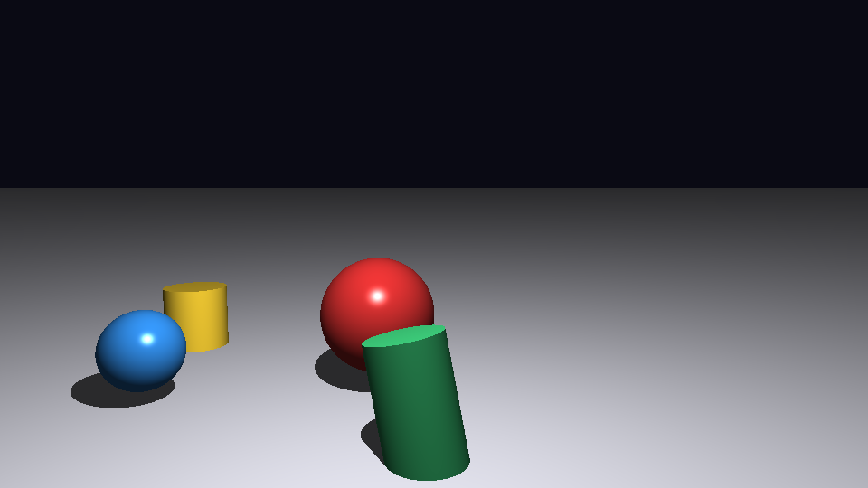
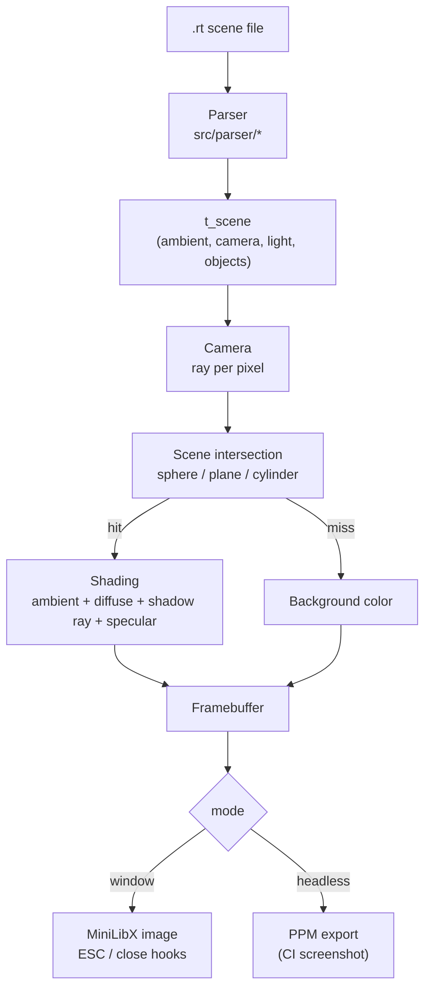

_This project has been created as part of the 42 curriculum by jgyy._

# miniRT



## Description

`miniRT` is a CPU ray tracer written in C using [MiniLibX](https://github.com/42Paris/minilibx-linux)
for display. It reads a scene description from a `.rt` file — an ambient light, a
camera, a point light, and any number of spheres, planes and cylinders — and renders
it into a window using ray/object intersection tests, ambient + diffuse (Phong)
lighting, and hard shadows.

Implemented per the [subject](minirt.md):

- Objects: sphere, plane, and a **finite** cylinder (side surface + both caps).
- Camera with configurable position, orientation and horizontal field of view.
- Translations for every object/camera/light, and rotation of the camera and the
  cylinder's axis, via the vectors given in the scene file.
- Ambient and diffuse lighting, plus hard shadows.
- A resizable window that keeps responding to the window manager (move, minimize,
  switch focus) while idle, closes on `ESC` or the window's close button, and
  frees every allocation on the way out.
- Strict `.rt` parsing: any malformed line prints `Error\n` and a message to
  `stderr`, then exits without leaking the memory already allocated.

**Bonus:** specular highlights (Phong reflection model), on top of the mandatory
ambient/diffuse/shadow model.

## Instructions

### Build

```sh
git clone --recurse-submodules <this repo>
cd minirt
make
```

The `Makefile` builds `libft`, vendors and builds
[`minilibx-linux`](minilibx-linux) (needs `libx11-dev` and `libxext-dev` —
`sudo apt-get install -y libx11-dev libxext-dev` on Debian/Ubuntu), then links
`miniRT`.

Rules: `all`, `clean`, `fclean`, `re`, `bonus` (the bonus feature is compiled in by
default, so `bonus` is currently an alias for `all`).

### Run

```sh
./miniRT scenes/showcase.rt
```

- `ESC` or the window's close button exits the program.
- A handful of example scenes live in [`scenes/`](scenes).

There is also a headless mode, used for automated screenshots/CI and quick
regression checks, that renders straight to a PPM file with no display/X11
connection required:

```sh
./miniRT scenes/showcase.rt out.ppm
```

## Architecture



## Resources

- [Subject: minirt.md](minirt.md) — the full project subject this README follows.
- [MiniLibX (Linux)](https://github.com/42Paris/minilibx-linux) — the graphics
  library used to open the window and blit the rendered image.
- Scratchapixel, [_Introduction to Ray Tracing_](https://www.scratchapixel.com/lessons/3d-basic-rendering/introduction-to-ray-tracing.html) —
  ray/sphere and ray/plane intersection derivations.
- Scratchapixel, [_Rendering a Cylinder / other quadrics_](https://www.scratchapixel.com/lessons/3d-basic-rendering/ray-tracing-rendering-a-triangle.html) —
  background for the finite-cylinder (side + caps) intersection used here.
- Peter Shirley, [_Ray Tracing in One Weekend_](https://raytracing.github.io/books/RayTracingInOneWeekend.html) —
  camera/viewport setup and the overall trace loop structure.
- [PNG specification](http://www.libpng.org/pub/png/spec/1.2/PNG-Contents.html) —
  used for the tiny PNG encoder in the CI screenshot step.

### AI usage

This project was built with substantial assistance from an AI coding assistant
(Claude Code, Anthropic), used for:

- Writing the raytracing engine itself (vector math, the sphere/plane/finite-cylinder
  intersection routines, the camera/viewport model, and the ambient/diffuse/shadow/
  specular shading), the `.rt` scene parser and its error handling, the small custom
  `libft`, and the MiniLibX window/hook glue code.
- Drafting the `Makefile`, the example `.rt` scenes, this `README.md`, and the
  GitHub Actions CI workflow (build + headless screenshot + Mermaid diagram render).
- Verifying the result: compiling with `-Wall -Wextra -Werror`, running `valgrind
  --leak-check=full` on both the headless render path and scene-parsing error paths,
  and exercising the windowed mode's `ESC` and close-window hooks under `Xvfb` with
  synthetic X11 events, in addition to visually inspecting the rendered scenes.

All AI-authored code was read, tested, and is understood well enough to be defended;
per the subject's AI-usage rules, treat this disclosure as the starting point for any
questions about which parts were AI-assisted and how.

## `.rt` scene format

See [Chapter IV of the subject](minirt.md#chapter-iv-mandatory-part---minirt) for the
authoritative format. Summary:

| Id | Element | Fields |
| --- | --- | --- |
| `A` | Ambient light | ratio `[0,1]`, color |
| `C` | Camera | position, normalized direction, horizontal FOV in degrees |
| `L` | Point light | position, brightness ratio `[0,1]`, color (unused in mandatory) |
| `sp` | Sphere | center, diameter, color |
| `pl` | Plane | point, normalized normal, color |
| `cy` | Cylinder | center, normalized axis, diameter, height, color |
