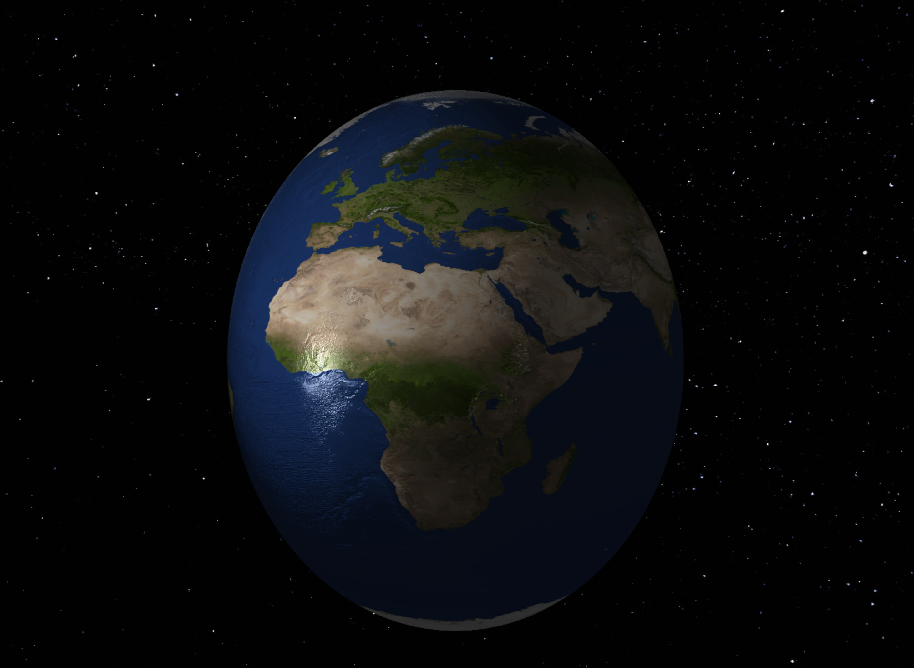
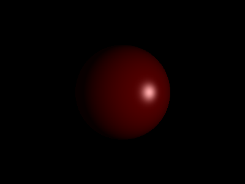
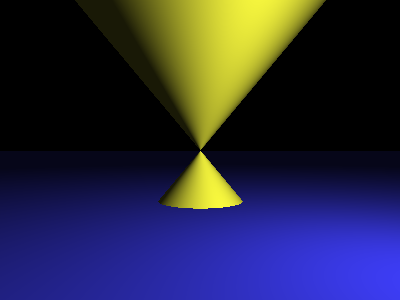
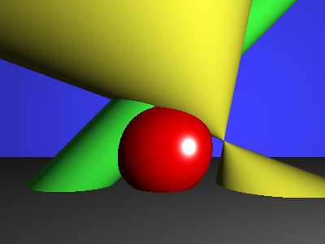
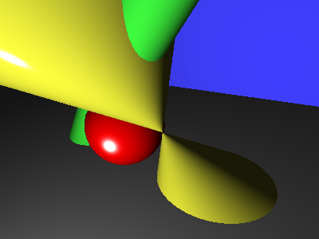
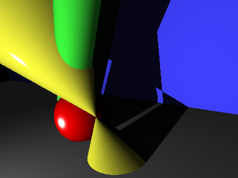
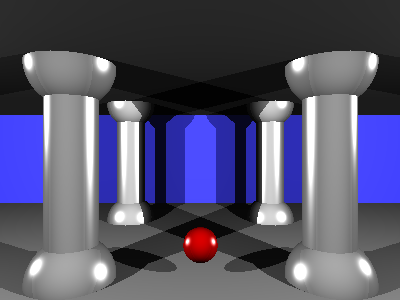
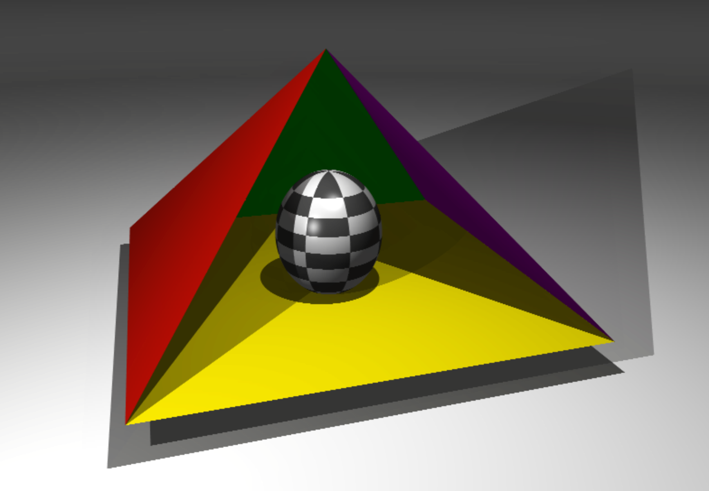

# miniRT

### My first RayTracer with MiniLibX

> _**Summary:** This project is an introduction to the beautiful world of Raytracing.
> Once completed, you will be able to render simple computer-generated images, and you
> will never be afraid of implementing mathematical formulas again._

_Version: 10.0_

## Contents

- [I. Introduction](#chapter-i-introduction)
- [II. Common Instructions](#chapter-ii-common-instructions)
- [III. AI Instructions](#chapter-iii-ai-instructions)
- [IV. Mandatory part - miniRT](#chapter-iv-mandatory-part---minirt)
- [V. Readme Requirements](#chapter-v-readme-requirements)
- [VI. Bonus part](#chapter-vi-bonus-part)
- [VII. Examples](#chapter-vii-examples)
- [VIII. Submission and peer-evaluation](#chapter-viii-submission-and-peer-evaluation)

---

## Chapter I: Introduction

When it comes to rendering three-dimensional computer-generated images, there are two
possible approaches: "`Rasterization`", which is used by almost all graphics engines
because of its efficiency, and "`Ray Tracing`."

The "`Ray Tracing`" method, developed for the first time in 1968 (but improved upon
since), is still more computationally expensive than the "`Rasterization`" method. As
a result, it is not yet fully adapted to real-time use cases but it produces a much higher
degree of visual realism.

<p align="center">
  
  
  
</p>

<p align="center"><em>Figure I.1: The pictures above are rendered with the ray tracing technique. Impressive, isn't it?</em></p>

Before you can even begin to produce such high-quality graphics, you must master the
basics: the `miniRT` is your first ray tracer coded in `C`, normed, humble, but `functional`.

The main goal of `miniRT` is to prove to yourself that you can implement any
mathematical or physical formulas without being a mathematician. We will only implement
the most basic ray tracing features here, so just keep calm, take a deep breath, and `don't
panic!` After this project, you will be able to show off nice-looking pictures to justify
the number of hours you are spending at school.

---

## Chapter II: Common Instructions

- Your project must be written in C.
- Your project must be written in accordance with the Norm. If you have bonus
  files/functions, they are included in the norm check, and you will receive a `0` if
  there is a norm error.
- Your functions should not quit unexpectedly (segmentation fault, bus error, double
  free, etc.) except for undefined behavior. If this occurs, your project will be
  considered non-functional and will receive a `0` during the evaluation.
- All heap-allocated memory must be properly freed when necessary. Memory leaks
  will not be tolerated.
- If the subject requires it, you must submit a `Makefile` that compiles your source
  files to the required output with the flags `-Wall`, `-Wextra`, and `-Werror`, using `cc`.
  Additionally, your `Makefile` must not perform unnecessary relinking.
- Your `Makefile` must contain at least the rules `$(NAME)`, `all`, `clean`, `fclean` and
  `re`.
- To submit bonuses for your project, you must include a `bonus` rule in your `Makefile`,
  which will add all the various headers, libraries, or functions that are not allowed in
  the main part of the project. Bonuses must be placed in `_bonus.{c/h}` files, unless
  the subject specifies otherwise. The evaluation of mandatory and bonus parts is
  conducted separately.
- If your project allows you to use your `libft`, you must copy its sources and its
  associated `Makefile` into a `libft` folder. Your project's `Makefile` must compile
  the library by using its `Makefile`, then compile the project.
- We encourage you to create test programs for your project, even though this work
  **does not need to be submitted and will not be graded**. It will give you an
  opportunity to easily test your work and your peers' work. You will find these tests
  especially useful during your defence. Indeed, during defence, you are free to use
  your tests and/or the tests of the peer you are evaluating.
- Submit your work to the assigned Git repository. Only the work in the Git repository
  will be graded. If Deepthought is assigned to grade your work, it will occur
  after your peer-evaluations. If an error happens in any section of your work during
  Deepthought's grading, the evaluation will stop.

---

## Chapter III: AI Instructions

#### ● Context

During your learning journey, AI can assist with many different tasks. Take the time to
explore the various capabilities of AI tools and how they can support your work. However,
always approach them with caution and critically assess the results. Whether it's
code, documentation, ideas, or technical explanations, you can never be completely sure
that your question was well-formed or that the generated content is accurate. Your peers
are a valuable resource to help you avoid mistakes and blind spots.

#### ● Main message

- ☛ Use AI to reduce repetitive or tedious tasks.
- ☛ Develop prompting skills — both coding and non-coding — that will benefit your
  future career.
- ☛ Learn how AI systems work to better anticipate and avoid common risks, biases,
  and ethical issues.
- ☛ Continue building both technical and power skills by working with your peers.
- ☛ Only use AI-generated content that you fully understand and can take responsibility
  for.

#### ● Learner rules:

- You should take the time to explore AI tools and understand how they work, so
  you can use them ethically and reduce potential biases.
- You should reflect on your problem before prompting — this helps you write clearer,
  more detailed, and more relevant prompts using accurate vocabulary.
- You should develop the habit of systematically checking, reviewing, questioning,
  and testing anything generated by AI.
- You should always seek peer review — don't rely solely on your own validation.

#### ● Phase outcomes:

- Develop both general-purpose and domain-specific prompting skills.
- Boost your productivity with effective use of AI tools.
- Continue strengthening computational thinking, problem-solving, adaptability, and
  collaboration.

#### ● Comments and examples:

- You'll regularly encounter situations — exams, evaluations, and more — where
  you must demonstrate real understanding. Be prepared, keep building both your
  technical and interpersonal skills.
- Explaining your reasoning and debating with peers often reveals gaps in your
  understanding. Make peer learning a priority.
- AI tools often lack your specific context and tend to provide generic responses. Your
  peers, who share your environment, can offer more relevant and accurate insights.
- Where AI tends to generate the most likely answer, your peers can provide alternative
  perspectives and valuable nuance. Rely on them as a quality checkpoint.

**✓ Good practice:**

> I ask AI: "How do I test a sorting function?" It gives me a few ideas. I try them out
> and review the results with a peer. We refine the approach together.

**✗ Bad practice:**

> I ask AI to write a whole function, copy-paste it into my project. During
> peer-evaluation, I can't explain what it does or why. I lose credibility — and I fail my
> project.

**✓ Good practice:**

> I use AI to help design a parser. Then I walk through the logic with a peer. We catch
> two bugs and rewrite it together — better, cleaner, and fully understood.

**✗ Bad practice:**

> I let Copilot generate my code for a key part of my project. It compiles, but I can't
> explain how it handles pipes. During the evaluation, I fail to justify and I fail my
> project.

---

## Chapter IV: Mandatory part - miniRT

| **Program Name** | `miniRT` |
| --- | --- |
| **Files to Submit** | All your files |
| **Makefile** | `all`, `clean`, `fclean`, `re`, `bonus` |
| **Arguments** | a scene in format `*.rt` |
| **External Function** | • `open`, `close`, `read`, `write`, `printf`, `malloc`, `free`, `perror`, `strerror`, `exit`.<br>• All functions of the math library. (Man page: `man math.h` or `man 3 math`. Don't forget to compile with the `-lm` flag).<br>• All functions of the MinilibX library.<br>• `gettimeofday()` |
| **Libft authorized** | Yes |
| **Description** | The goal of your program is to generate images using the Raytracing protocol. Those computer-generated images will each represent a scene, as seen from a specific angle and position, defined by simple geometric objects, and each with its own lighting system. |

The constraints are as follows:

- You **must** use the `miniLibX` library, either the version that is available on the
  operating system, or from its sources. If you choose to work with the sources, you
  will need to apply the same rules for your `libft` as those written above in
  [Common Instructions](#chapter-ii-common-instructions) part.
- The management of your window must remain fluid: switching to another window,
  minimization, etc.
- You need at least these three simple geometric objects: plane, sphere, cylinder.
- If applicable, all possible intersections and the insides of the objects must be handled
  correctly.
- Your program must be able to resize the unique properties of objects: diameter for
  a sphere and the width and height for a cylinder.
- Your program must be able to apply translation and rotation transformations to
  objects, lights, and cameras (except for spheres and lights that cannot be rotated).
- Light management: spot brightness, hard shadows, ambient lighting (objects are
  never completely in the dark). You must implement ambient and diffuse lighting.
- The program displays the image in a window and respects the following rules:
  - Pressing `ESC` must close the window and quit the program cleanly.
  - Clicking on the red cross on the window frame must close the window and quit
    the program cleanly.
  - The use of `images` from the `minilibX` library is strongly recommended.
- Your program must take as its first argument a scene description file with the `.rt`
  extension.
  - Each type of element can be separated by one or more line breaks.
  - Each type of information from an element can be separated by one or more
    spaces.
  - Each type of element can be set in any order in the file.
  - Elements defined by a capital letter can only be declared once in the scene.
  - The first piece of information for each element is the type identifier (composed
    of one or two characters), followed by all specific information for each object
    in a strict order such as:
  - **Ambient lighting:**

    ```
    A 0.2 255,255,255
    ```

    - identifier: **A**
    - ambient lighting ratio in the range [0.0,1.0]: **0.2**
    - R, G, B colors in the range [0-255]: **255, 255, 255**
  - **Camera:**

    ```
    C  -50.0,0,20     0,0,1   70
    ```

    - identifier: **C**
    - x, y, z coordinates of the viewpoint: **-50.0,0,20**
    - 3D normalized orientation vector, in the range [-1,1] for each x, y, z axis:
      **0.0,0.0,1.0**
    - FOV: Horizontal field of view in degrees in the range [0,180]: **70**
  - **Light:**

    ```
    L   -40.0,50.0,0.0  0.6     10,0,255
    ```

    - identifier: **L**
    - x, y, z coordinates of the light point: **-40.0,50.0,0.0**
    - the light brightness ratio in the range [0.0,1.0]: **0.6**
    - (unused in mandatory part) R, G, B colors in the range [0-255]: **10, 0, 255**
  - **Sphere:**

    ```
    sp  0.0,0.0,20.6  12.6  10,0,255
    ```

    - identifier: **sp**
    - x, y, z coordinates of the sphere center: **0.0,0.0,20.6**
    - the sphere diameter: **12.6**
    - R,G,B colors in the range [0-255]: **10, 0, 255**
  - **Plane:**

    ```
    pl  0.0,0.0,-10.0  0.0,1.0,0.0 0,0,225
    ```

    - identifier: **pl**
    - x, y, z coordinates of a point in the plane: **0.0,0.0,-10.0**
    - 3D normalized normal vector, in the range [-1,1] for each x, y, z axis:
      **0.0,1.0,0.0**
    - R,G,B colors in the range [0-255]: **0,0,225**
  - **Cylinder:**

    ```
    cy  50.0,0.0,20.6    0.0,0.0,1.0 14.2  21.42   10,0,255
    ```

    - identifier: **cy**
    - x, y, z coordinates of the center of the cylinder: **50.0,0.0,20.6**
    - 3D normalized vector of axis of cylinder, in the range [-1,1] for each x, y,
      z axis: **0.0,0.0,1.0**
    - the cylinder diameter: **14.2**
    - the cylinder height: **21.42**
    - R, G, B colors in the range [0,255]: **10, 0, 255**
- Example of the mandatory part with a minimalist **.rt** scene:

  ```
  A   0.2                                     255,255,255

  C   -50,0,20      0,0,1       70
  L   -40,0,30                  0.7           255,255,255

  pl  0,0,0         0,1.0,0                   255,0,225
  sp  0,0,20                    20            255,0,0
  cy  50.0,0.0,20.6 0,0,1.0     14.2  21.42   10,0,255
  ```

- If any misconfiguration of any kind is encountered in the file, the program must exit
  properly and return `"Error\n"` followed by an explicit error message of your choice.
- For the defense, it would be ideal for you to have a whole set of scenes focused on
  what is functional, to facilitate the control of the elements to create.

---

## Chapter V: Readme Requirements

A `README.md` file must be provided at the root of your Git repository. Its purpose is
to allow anyone unfamiliar with the project (peers, staff, recruiters, etc.) to quickly
understand what the project is about, how to run it, and where to find more information
on the topic.

The `README.md` must include at least:

- The very first line must be italicized and read: _This project has been created as part
  of the 42 curriculum by \<login1\>[, \<login2\>[, \<login3\>[...]]]._
- A "**Description**" section that clearly presents the project, including its goal and a
  brief overview.
- An "**Instructions**" section containing any relevant information about compilation,
  installation, and/or execution.
- A "**Resources**" section listing classic references related to the topic (documentation,
  articles, tutorials, etc.), as well as a description of how AI was used —
  specifying for which tasks and which parts of the project.

➠ **Additional sections may be required depending on the project** (e.g., usage
examples, feature list, technical choices, etc.).

Any required additions will be explicitly listed below.

> [!NOTE]
> Your README must be written in English.

---

## Chapter VI: Bonus part

The `Ray-Tracing` technique could handle many more things like reflection, transparency,
refraction, more complex objects, soft shadows, caustics, global illumination, bump
mapping, .obj file rendering, etc.

But for the `miniRT` project, we want to keep things simple for your first ray tracer and
your first steps in CGI.

Here is a list of a few simple bonuses you could implement. If you want to do bigger
bonuses, we strongly advise you to recode a new ray tracer later in your developer life
after this little one is finished and fully functional.



_Figure VI.1: A spot, a space skybox, and a shiny earth-textured sphere with bump-mapping_

> [!WARNING]
> Bonuses will be evaluated only if your mandatory part is perfect.
> By perfect we naturally mean that it needs to be complete, that it
> cannot fail, even in cases of nasty mistakes like wrong uses, etc.
> It means that if your mandatory part does not obtain all the points
> during the grading, your bonuses will be entirely ignored.

Bonus list:

- Add specular reflection to achieve a full Phong reflection model.
- Color disruption: checkerboard pattern.
- Colored and multi-spot lights.
- One other second-degree object: cone, hyperboloid, paraboloid..
- Handle bump map textures.

> [!NOTE]
> You are allowed to use other functions and add features to your
> scene description to complete the bonus part, as long as their use is
> justified during your evaluation. You are also allowed to modify the
> expected scene file format to fit your needs. Be smart!

---

## Chapter VII: Examples



_Figure VII.1: A sphere, one spot, some shine (optional)._


_Figure VII.2: A cylinder, one spot._



_Figure VII.3: A cone (optional), a plane, one spot._



_Figure VII.4: A bit of everything, including 2 planes._



_Figure VII.5: Same scene different camera._



_Figure VII.6: This time with shadows._



_Figure VII.7: With multiple spots._



_Figure VII.8: And finally, with multiple spots and a shiny checkered (optional) sphere in
the middle._

---

## Chapter VIII: Submission and peer-evaluation

Submit your assignment in your `Git` repository as usual. Only the work inside your
repository will be evaluated during the defense. Don't hesitate to double-check the names of
your files to ensure they are correct.

During the evaluation, a brief **modification of the project** may occasionally be
requested. This could involve a minor behavior change, a few lines of code to write or
rewrite, or an easy-to-add feature.

While this step may **not be applicable to every project**, you must be prepared for it
if it is mentioned in the evaluation guidelines.

This step is meant to verify your actual understanding of a specific part of the project.
The modification can be performed in any development environment you choose (e.g.,
your usual setup), and it should be feasible within a few minutes — unless a specific
timeframe is defined as part of the evaluation.

You can, for example, be asked to make a small update to a function or script, modify a
display, or adjust a data structure to store new information, etc.

The details (scope, target, etc.) will be specified in the **evaluation guidelines** and may
vary from one evaluation to another for the same project.
